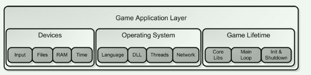
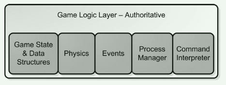
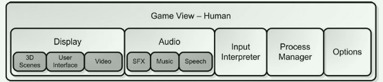

# Game Coding Complete4读书笔记
## 第一章
全是废话，跳过
## 第二章
### Game Architecture
游戏子系统可以分为三类：

1.application layer：处理硬件与操作系统，便于游戏的跨平台操作。

2.game logic layer：处理游戏状态以及如何随时间改变，诸如物理系统。

3.game view layer：用图形声音等展示游戏状态，接收用户的输入并转换成游戏命令发送给逻辑层

### Application Layer

#### Reading Input
读取游戏设备输入，并且支持可配置的文件

#### File Systems and Resource Caching
对于读取文件以及文件的缓存系统

#### Managing Memory
追踪游戏的内存分配并且管理内存

#### Initialization, the Main Loop, and Shutdown
游戏的生命周期，主循环中包含获取玩家输入队列，执行游戏逻辑，将游戏状态呈现到视图中。

#### Other Application Layer Code
譬如：
- 系统时钟：同步动画声音物理等系统
- 字符处理：处理游戏跨语言跨文化需求
- 动态加载库：如使用dll交换DirectX与OpenGL
- 线程和线程同步
- 网络通信
- 初始化
- 主循环
- 关闭

### Game Logic

#### Game State and Data Structures
平衡游戏对象的搜索速度和灵活性问题，游戏对象属性的存储方式，逻辑对象与视图对象的区别

#### Physics and Collision
越真实的游戏越注意细小的错误

#### Events
事件系统用于黏合整个游戏架构，使得游戏系统更加整洁和高效

#### Process Manager
进程管理

#### Command Interpreter

### Game View For The Human Player

#### Graphics Display
