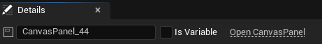
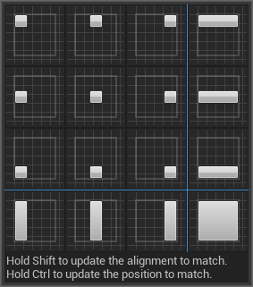

# UMG
## 概念
UMG，即Unreal Motion Graphics UI Designer，是虚幻引擎用于创建UI的编辑工具
## 通用设置
IsVariable属性位于控件名字旁，勾选与否可以决定是否将控件提升为变量，在蓝图中获取与设置，右侧超链接可以打开对应控件的代码

## Slot
除最底层canvas外，widget均有slot属性，用于控制widget在父控件中的布局
### Canvas Panel Slot
#### anchors
锚点,可理解为参考系，用于确定widget在父控件中的相对位置，如图

左上角九宫格使用非填充模式，其余七个为填充模式
##### 非填充模式
该模式下使用某一固定点作为参考，如左上角，右上角等，Position决定子控件slot相对于父控件锚点的相对位置，size则决定了子控件的大小
这两个参数均为面板数值，实际表现受屏幕缩放比例影响
##### 填充模式
如第四列第一个，为X方向使用填充模式，Y方向使用非填充模式，OffSet属性设置了距离父控件左边界和右边界的距离，同样受到屏幕缩放比例的影响

上图中十六种锚点仅用于设置方便，实际设置可手动拖动锚点来任意设置锚点位置，也可以设置Minimum与Maxmum的值来设置锚点位置，当Minmum与Maxmum的x分量相同时，x方向为非填充模式，否则为填充模式，y方向同理

#### alignment
校准，在anchors定位的基础上做二次位移，其中值以widget本身的size为基础，如x=1，则向左移动一个size.x的距离，若为填充模式，则无效

#### Size To Content
根据子控件大小适应自身大小，只对所有子控件做适应，子控件的子控件不考虑，只适应size，slot对于锚点的相对位置不变，填充模式下无效

#### ZOrder
用于调整同一个控件的诸多子控件渲染层级，消耗较大，尽量不用

### Button Slot
仅包含三个属性，Padding决定对于父控件的填充大小（填充优先级大于控件本身的size，且影响size to content），alignment则决定button去掉填充后的部分中，控件的位置

### Overlay Slot
同上

## 渲染
### 渲染顺序
一般情况下，对于同一个控件的多个子控件，按照从上向下的顺序渲染，所以下方控件一般会覆盖上方控件，但可以根据ZOrder做出更改（ZOrder仅针对同一控件的子控件生效，多个不同控件的子控件不能根据ZOrder判断）

### Slate合批
